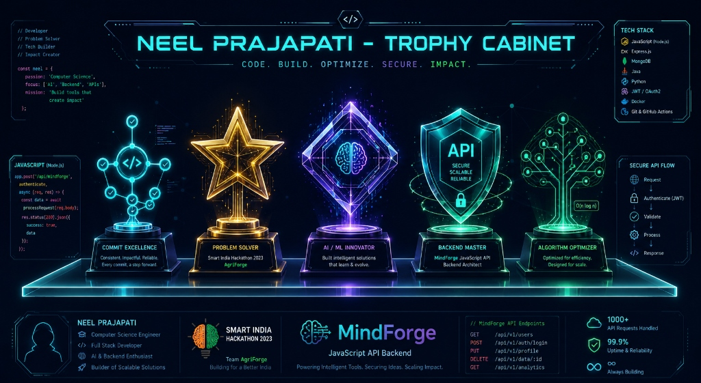

<!-- ===================== HERO / MARIO BANNER ===================== -->
<div align="center">


</div>

<br/><br/>

<!-- ===================== HEADER / WAVING BANNER ===================== -->
<div align="center">

<a href="https://github.com/Sumit-Patel08">
  
</a>

<br/>

<a href="https://git.io/typing-svg">
  
</a>

<br/>

<!-- ===================== PROFILE BADGES ===================== -->

<a href="https://github.com/Sumit-Patel08?tab=followers">
  
</a>


</div>

<!-- ===================== SOCIAL CONNECT ===================== -->
<div align="center">

<a href="https://www.linkedin.com/in/sumit-patel-25bb02339">
  
</a>
<a href="mailto:sumit.patel0809@gmail.com">
  
</a>
<a href="./assets/Sumit_Resume.pdf">
  
</a>
<a href="https://sumit-portfolio-navy.vercel.app/">
  
</a>
<a href="https://github.com/Sumit-Patel08">
  
</a>

<br/><br/>


</div>

<!-- ===================== ABOUT ME ===================== -->

##  &nbsp;Whoami

```python
class SumitPatel:
    def __init__(self):
        self.role        = "Full-Stack Developer & AI Enthusiast"
        self.education   = "B.E. Computer Engineering"
        self.location    = "Gujarat, India"

        self.current_focus = [
            "Full-stack web apps with React & Node.js",
            "Generative AI & intelligent agent systems",
            "Scalable backends with PostgreSQL & REST APIs",
            "Data structures, algorithms & system design",
        ]

        self.fun_fact = "I don't just write code — I ship projects "
                        "to production on Vercel and keep iterating "
                        "until they feel polished 🚀"

    def life_motto(self):
        return "Build. Learn. Improve. Repeat."
```

<br/>

<table>
  <tr>
    <td width="55px" align="center">🔭</td>
    <td>Currently building <b>full-stack web applications</b> — from blockchain explorers and ticket booking platforms to AI-powered environmental monitoring systems.</td>
  </tr>
  <tr>
    <td align="center">🌱</td>
    <td>Leveling up in the <b>React.js & Next.js</b> ecosystem while sharpening <b>C++ / Java / Python</b> for competitive programming.</td>
  </tr>
  <tr>
    <td align="center">🤝</td>
    <td>Open to collaborating on <b>hackathons</b>, <b>Generative AI</b>, and <b>full-stack MERN</b> projects.</td>
  </tr>
  <tr>
    <td align="center">💬</td>
    <td>Ask me about <b>deploying production apps</b>, building <b>AI dashboards</b>, or surviving intense hackathon sprints.</td>
  </tr>
  <tr>
    <td align="center">⚡</td>
    <td><i>Build. Learn. Improve. Repeat.</i></td>
  </tr>
</table>

<div align="center">

</div>

<!-- ===================== TECH STACK ===================== -->
##  &nbsp;Tech Arsenal

<div align="center">


### 💻 Languages


### 🌐 Web & Frameworks


### 🤖 AI / ML


### 🗄️ Databases & Cloud


### 🛠️ Tools


</div>

<div align="center">

</div>

<!-- ===================== FEATURED PROJECTS ===================== -->
##  &nbsp;Featured Projects

<div align="center">

</div>

<br/>

<table width="100%">
  <tr>
    <td width="2%"></td>
    <td width="46%" valign="top">
      <h3>⛓️ ArbiChain Explorer</h3>
      <b>Web3 • Blockchain • TypeScript</b>
      <p>Educational 4-page website explaining <b>Arbitrum & Layer 2 scaling</b> with interactive concepts, live crypto prices via CoinGecko API, and a <b>SHA-256 proof-of-work block simulator</b> running entirely in the browser.</p>
      <p>🚀 <a href="https://arbi-chain-explorer.vercel.app">Live Demo</a> · <a href="https://github.com/Sumit-Patel08/ArbiChain-Explorer">Source</a></p>
      <p>
        
        
        
        
      </p>
    </td>
    <td width="4%"></td>
    <td width="46%" valign="top">
      <h3>🌊 Coastal Threat Alert System</h3>
      <b>AI/ML • Environmental Monitoring • Full-Stack</b>
      <p>Early warning system analyzing <b>sensor & satellite data</b> to detect coastal threats — storms, erosion, algal blooms & illegal dumping — sending timely alerts via SMS, app & dashboards to protect lives & blue carbon ecosystems.</p>
      <p>🌍 Built for real-world environmental impact.</p>
      <p>
        
        
        
        
      </p>
    </td>
    <td width="2%"></td>
  </tr>
  <tr>
    <td width="2%"></td>
    <td width="46%" valign="top">
      <h3>🤖 AgentArena</h3>
      <b>Generative AI • Full-Stack • Agents</b>
      <p>A platform for building and exploring <b>AI agent workflows</b> — experimenting with generative AI pipelines to create intelligent, interactive applications.</p>
      <p>🚀 <a href="https://agent-arena-murex.vercel.app">Live Demo</a> · <a href="https://github.com/Sumit-Patel08/AgentArena">Source</a></p>
      <p>
        
        
        
        
      </p>
    </td>
    <td width="4%"></td>
    <td width="46%" valign="top">
      <h3>🎫 Ticket Booking Platform</h3>
      <b>Full-Stack • Web App • Deployment</b>
      <p>A complete <b>ticket booking web application</b> with user flows for browsing events, selecting seats, and completing bookings — deployed and accessible online.</p>
      <p>🚀 <a href="https://ticket-booking-platform-1.vercel.app">Live Demo</a> · <a href="https://github.com/Sumit-Patel08/ticket-booking-platform--1-">Source</a></p>
      <p>
        
        
        
        
      </p>
    </td>
    <td width="2%"></td>
  </tr>
  <tr>
    <td width="2%"></td>
    <td width="46%" valign="top">
      <h3>💼 Sumit Portfolio</h3>
      <b>Web Development • UI/UX • Deployment</b>
      <p>Personal <b>portfolio website</b> showcasing projects, skills & experience — built with React, TanStack, Tailwind CSS, and Framer Motion, deployed on Vercel.</p>
      <p>🚀 <a href="https://sumit-portfolio-navy.vercel.app/">Live Demo</a> · <a href="https://github.com/Sumit-Patel08/Sumit-Portfolio">Source</a></p>
      <p>
        
        
        
        
      </p>
    </td>
    <td width="4%"></td>
    <td width="46%" valign="top">
      <h3>🐄 Hackovate — Dairy Dashboard</h3>
      <b>AI/ML • Sensor Data • Hackathon</b>
      <p>Hackathon project building an <b>ML-powered dairy dashboard</b> for monitoring cattle health and milk yield using sensor data and predictive analytics.</p>
      <p>🎯 Built at <b>Hackovate</b> — pushing data-driven agriculture solutions.</p>
      <p>
        
        
        
        
      </p>
    </td>
    <td width="2%"></td>
  </tr>
</table>

<div align="center">

</div>

<!-- ===================== ACHIEVEMENTS ===================== -->
##  &nbsp;Achievements & Highlights

<table>
  <tr>
    <td width="60%" valign="top">

| 🏆 Highlight | 📋 Detail |
|:---|:---|
| 🚀 **12+ Public Repositories** | Active GitHub with diverse projects spanning AI, Web3, and full-stack |
| 🌊 **Coastal Threat Alert System** | Built an AI-powered environmental monitoring & early warning platform |
| ⛓️ **ArbiChain Explorer** | Shipped a live blockchain education tool with PoW simulator on Vercel |
| 🤖 **AgentArena** | Deployed a generative AI agent platform for real-world experimentation |
| 🎫 **Ticket Booking Platform** | End-to-end full-stack app with live production deployment |
| 🏅 **Hackovate Participant** | Competed with an ML-driven dairy health & yield dashboard |

    </td>
    <td width="40%" align="center" valign="middle">
      
    </td>
  </tr>
</table>

<div align="center">

</div>

<!-- ===================== CURRENTLY LEARNING ===================== -->
##  &nbsp;Currently Learning

- ⚛️ **React & Next.js** — SSR, server components & modern frontend patterns
- 🗄️ **PostgreSQL & REST APIs** — scalable backend architecture
- 🔐 **Authentication & Authorization** — JWT, OAuth & secure session management
- 🐳 **Docker & Cloud Deployment** — containerization & CI/CD pipelines
- 🧠 **System Design** — building applications that scale
- 📊 **Data Structures & Algorithms** — sharpening problem-solving skills

<div align="center">

</div>

<!-- ===================== GITHUB STATS ===================== -->
##  &nbsp;GitHub Analytics

<div align="center">


<br/><br/>

<!-- Stats — using local assets for reliable display -->


<br/><br/>


<br/><br/>


</div>

<div align="center">

</div>

<!-- ===================== FOOTER ===================== -->
<div align="center">


### 💌 Let's build something awesome.

<a href="https://www.linkedin.com/in/sumit-patel-25bb02339">
  
</a>
<a href="mailto:sumit.patel0809@gmail.com">
  
</a>

<br/><br/>


</div>
